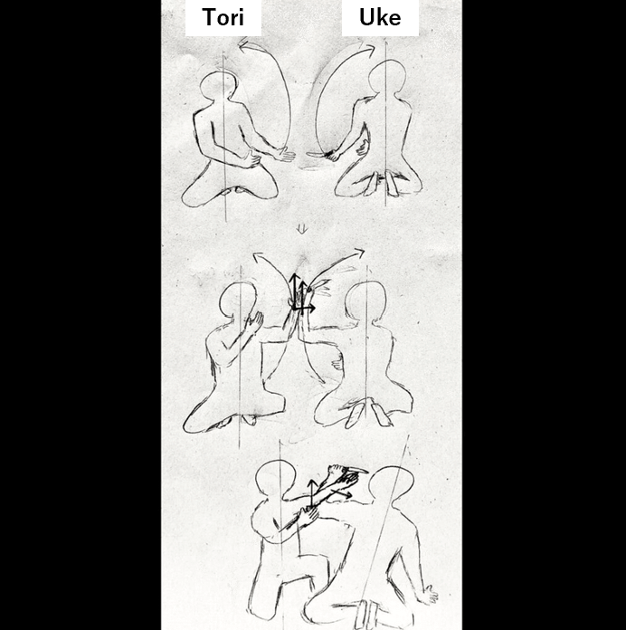

# I want to quantitatively evaluate Aikido techniques

1. About Aikido

Dear readers, have you ever heard of the martial art of Aikido?
The Aikikai Foundation explains Aikido on its official website as follows.

> Aikido is a modern martial art founded by Morihei Ueshiba (1883-1969), the founder of Aikido. Aikido does not unnecessarily compete with opponents in terms of strength or weakness. The goal of Aikido is to train and develop the body and mind through friendly competition with each other using techniques born from the bodywork and breathing power of Irimi and Conversion. Aikido does not compete with others for superiority or inferiority, so there are no matches or competitions.  
> After the passing of the founder, Morihei Ueshiba, the late Kichishomaru Ueshiba (1921-1999) succeeded as the head of the dojo, which opened its doors to the general public and spread throughout the world.

[What is Aikido｜Aikikikai Foundation](http://www.aikikai.or.jp/aikido/index.html)

A video of the founder, Morihei Ueshiba, was uploaded to YouTube. Please watch the following video to get a rough understanding of what kind of martial art Aikido is.

[植芝 盛平 1935 Original](https://youtu.be/d_edhmu-iFE)

Aikido is now practiced all over the world by men, women, and children of all ages.

> Aikido is expanding globally. The overseas spread of Aikido began in the 1950s, and currently (2018) there are organizations and associations in approximately 140 countries, about 70% of the world’s countries.

[About Aikido｜Aikikai Foundation](http://www.aikikai.or.jp/aikido/about.html)

In addition, according to the official Aikikai website, “Aikido does not compete with others for superiority or inferiority, and therefore does not involve matches or competitions.” In other words, if we were to classify Aikido as a sport, it would be a lifelong sport, not a competitive sport.
The difference between a lifelong sport and a competitive sport is explained in the following website.

>Lifelong sports refer to sports that can be enjoyed by “anyone, anywhere, anytime throughout one’s life” for the purpose of health promotion and socializing.  
> Competitive sports, on the other hand, are those in which athletes seek to improve their sports skills and records, and pursue challenges to the limits of human potential. International competitions that are considered the pinnacle of competitive sports are the Olympic Games and Paralympic Games, while international competitions that are the pinnacle of lifetime sports are the World Masters Games.  
> In competitive sports, the main objective is to “win or lose” against an opponent or yourself. You strive to win and inspire those who watch. Lifelong sports have the purpose of playing the sport itself. Therefore, although there will be winners and losers in the World Masters Games and other lifetime sports competitions, it is clear that they are different from competitive sports because playing sports itself is the main purpose of lifetime sports.

[What is Lifelong Sports｜Longevity Science Foundation](https://www.tyojyu.or.jp/net/kenkou-tyoju/shintai-shumi/sports.html#:~:text=%E4%B8%80%E6%96%B9%E7%AB%B6%E6%8A%80%E3%82%B9%E3%83%9D%E3%83%BC%E3%83%84%E3%81%AF%E3%80%81%E3%82%B9%E3%83%9D%E3%83%BC%E3%83%84,%E3%83%AF%E3%83%BC%E3%83%AB%E3%83%89%E3%83%9E%E3%82%B9%E3%82%BF%E3%83%BC%E3%82%BA%E3%82%B2%E3%83%BC%E3%83%A0%E3%82%BA%E3%81%8C%E3%81%82%E3%82%8A%E3%81%BE%E3%81%99%E3%80%82)

 However, since Aikido does not involve competition, there are no winners or losers.  
Therefore, although it is similar to a lifelong sport, it cannot be considered within the framework of a sport.  
In other words, Aikido is a lifelong martial art that aims to develop one’s mind and body.

2. Aikido aims at “growth”. In other words, we need a way to properly evaluate “growth”!

Now, let me cut to the chase. In order to judge the progress of Aikido techniques as a result of repeated practice, it is necessary to have a method to quantitatively evaluate the progress of Aikido techniques.

The reason why quantitative evaluation is necessary is that it is difficult to evaluate the pure skill of a technique due to the relational position of the person performing the technique (hereinafter referred to as “tori”) and the excessive ukemi of the person receiving the technique (hereinafter referred to as “uke”). It is difficult to evaluate the pure skill of a technique.

For example, when we look at the techniques of a “master” who has been practicing Aikido for many years, we may say, “I don’t know what makes it so great, but it must be great.” This is not appropriate because preconceived notions are getting in the way of a pure appreciation of the technique.  
In my personal opinion, no matter how long a practitioner has been practicing Aikido, he or she should always aim for “growth” when practicing Aikido. Therefore, regardless of the level of mastery of a person’s technique or the amount of time he or she has practiced, there needs to be a way to properly evaluate those who are striving for growth.

3. Goals of Aikido Movements

In order to quantitatively evaluate movement, it is first necessary to set a “goal” for the movement.

Let us assume that the goal of an Aikido movement is making attacker unattackable. And it is thought that Aikido uses the following strategies as a means of achieving its goals.

- Disrupts the physical balance of the opponent.
- Reduce the opponent’s joint degrees of freedom.
- Distance yourself from your opponent.

In other words, the movements that Aikido aims for can be described as the most optimal movements for implementing the above three strategies.

In addition to that, Aikido has a strategy of not destroying the opponent’s body.

In order to achieve the goal of “Making attacker unattackable”, martial arts such as Karate, Judo, and Kendo choose the strategy of destroying the attacker’s body with strikes.
Aikido, on the other hand, breaks the attacker’s posture by not interfering with the attacker’s movements. For example, in Zagi(Seated techniques) Shomen Uchi Ikkyo, the moment the Uke raises his arm to slash the Tori’s head with his sword from the front, the Uke is broken in posture.

Here, it is thought that tori can break down the opponent at the point of contact with uke by applying the same force as the direction of the opponent’s force vector, so that uke cannot resist.
Thus, by describing Aikido movements from a scientific perspective, we will be able to create an index for quantitatively evaluating movements.

4. My passion for Aikido

I am currently studying physics at a university in Japan. At the same time, I practice Aikido daily at a dojo belonging to Aikikai.  
And when I look at Aikido from a natural scientific point of view, I feel that there is still a lot of room for research.  
Also, in my research life, I have a major theme to prove the rationality of Aikido techniques.

As part of aikido training, it is often the case that the ukemi is taken by the uke without going against the tori’s movement. It may be that Aikido inexperienced people say that Aikido is a fake or something. You can find it by looking in the comments section of Aikido videos uploaded to YouTube. After experiencing firsthand the rationality of Aikido, I felt an indescribable sense of frustration at the sight of it. At the same time, I strongly felt that I had a mission to scientifically prove the rationality of Aikido techniques.

From now on, I will continue to study physics and other studies related to physical exercise in order to become a professional in motion analysis. I would also like to describe Aikido techniques from a scientific perspective and introduce a quantitative evaluation method to Aikido.

Dear readers who have read this far, I will continue to study Aikido with passion, and I hope you will continue to support me!