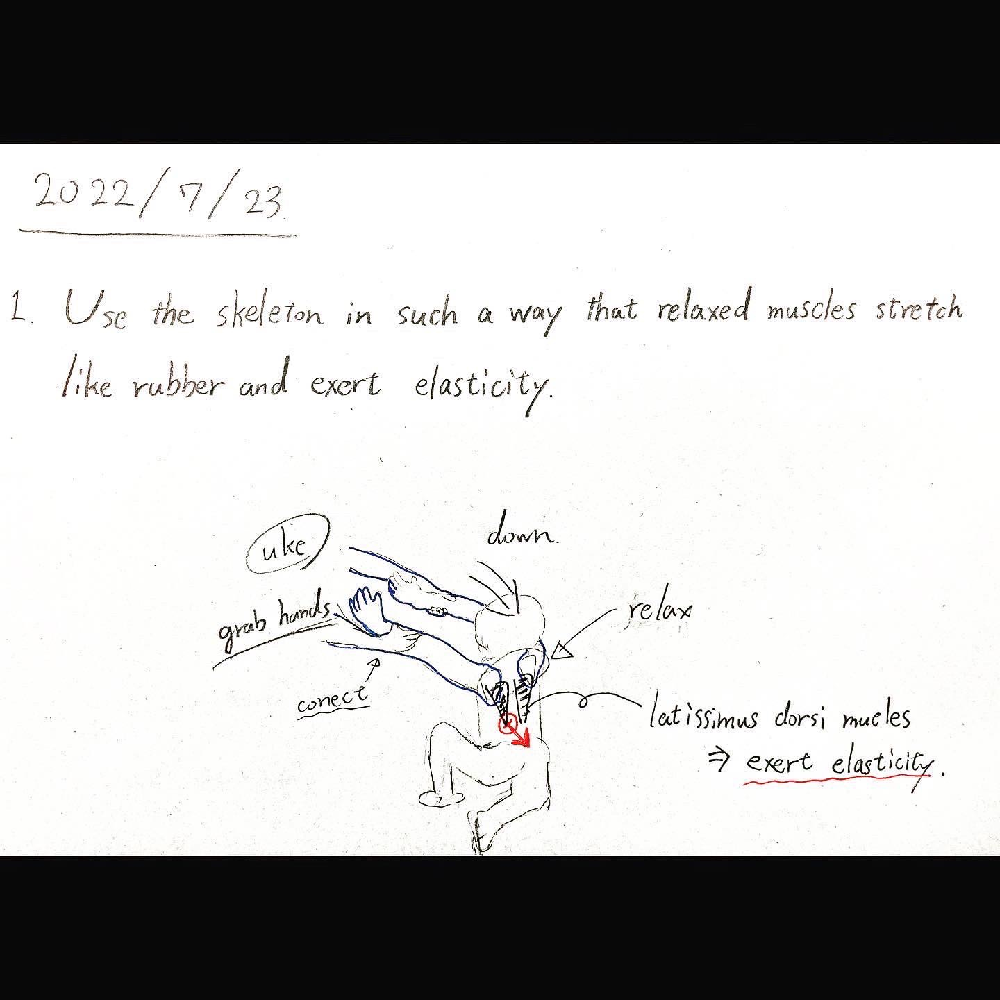
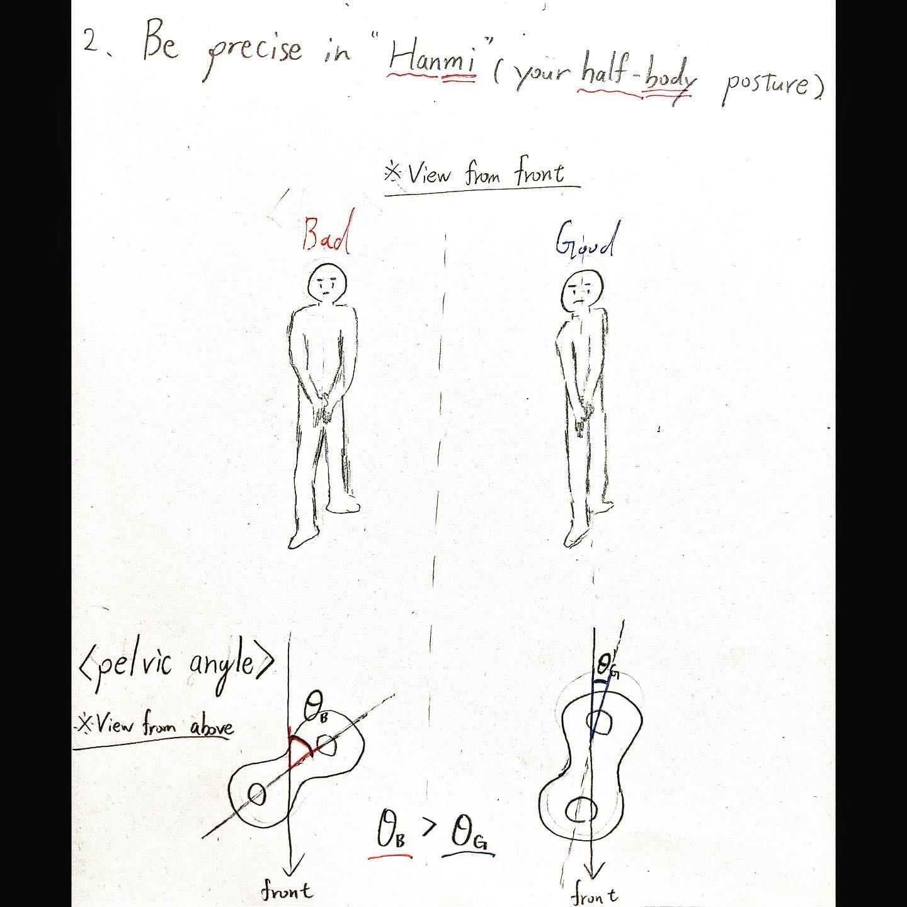
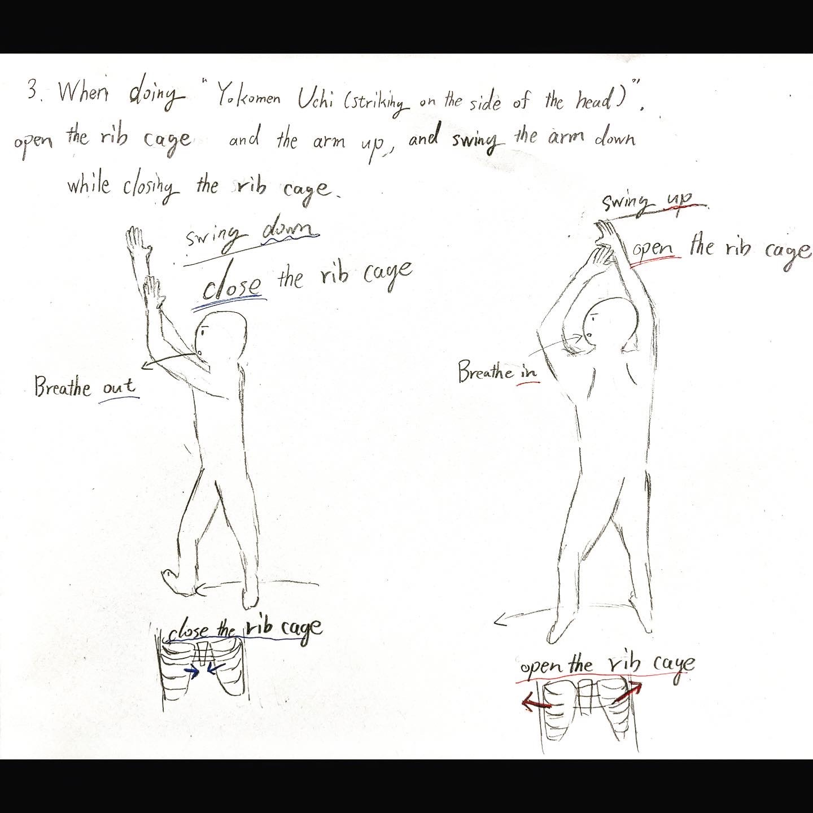

# 2022 July

# 2022/7/23
1. Use the skeleton in such a way that relaxed muscles stretch like rubber and exert elasticity.

2. Be precise in “Han1mi”(your half-body posture).

3. When doing “Yokomenn Uchi(striking on the side of the head)”, open the rib cage and swing the arm up, and swing the arm down while closing the rib cage.

# 2022/7/26
1. When taking the Hanmi posture, bring the front side of the pelvis closer to the direction of forward motion.
2. When doing “Yokomen Uchi”, make sure your arms move on your own midline.
3. When doing “Shiho Nage”, swing your arm down in a trajectory along Uke’s back.

# 2022/7/27
1. When doing “Ukimi”;Raising the center of gravity and stretch up, relax and don’t strain.
2. When doing “Shikko”;knee walk, stabilize the height of the center of gravity.
3. Accept each other’s power.

# 2022/7/30
1. When doing “Shikko”, keep moving your abdominal muscles.
2. When doing “Zagi”, do not lean forward.
3. The arms are manipulated by the movement of the trunk.